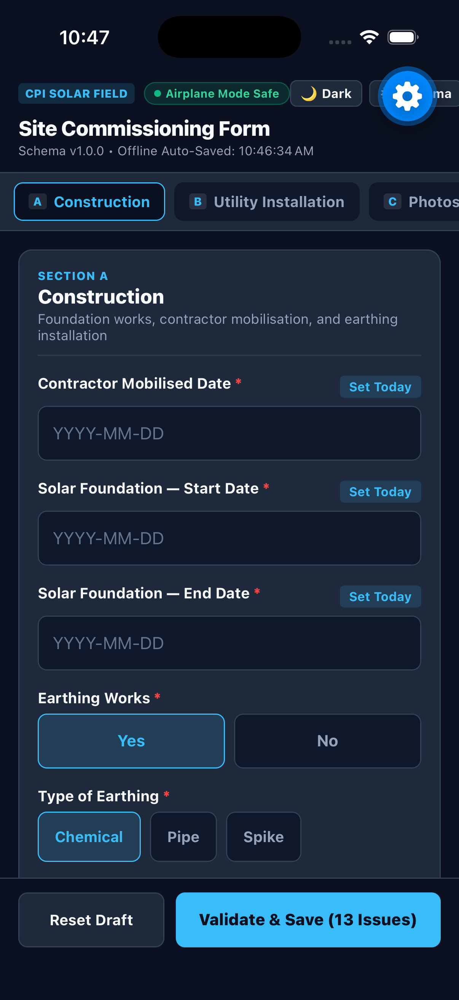

# CPI_Solar_field

## CPI Site Commissioning Mobile App — Offline Field Capture (React Native / Expo)



A native, schema-driven, offline-first mobile application built for **Cost Plus, Inc. (CPI)** field engineers commissioning solar installations across off-grid Philippine provinces without network connectivity.

---

## 1. Quick Start & Running the Mobile App

### Prerequisites
- Node.js (v18+) & npm
- [Expo Go](https://expo.dev/go) app on your physical iOS or Android phone, OR an active simulator / emulator.

### Run with Expo
```bash
# 1. Install dependencies (already pre-installed)
npm install

# 2. Run automated validation test suite
npm test

# 3. Start Expo development server
npx expo start
```
- **Physical Phone:** Scan the generated QR code using the **Expo Go** app (Android) or the native Camera app (iOS).
- **Android Emulator:** Press `a` in the terminal.
- **iOS Simulator:** Press `i` in the terminal.
- **Web Preview:** Press `w` in the terminal.

---

## 2. Architecture: Declarative Schema Engine

### The Problem
Solar cooperatives across the Philippines frequently alter commissioning rules, equipment ratings, and required photo documentation. Re-releasing native app binaries through Apple App Store and Google Play Store review processes for every change is impossible for field crews offline for up to a week.

### The Solution
We decoupled the **Form Definition** from the **Native Rendering Engine**:
1. **Declarative Specification (`src/schema.json`):**
   Sections, fields, conditional visibility predicates (`visible_when`), calculation formulas, validation constraints, repeater structures, and photo groups are defined declaratively in JSON.
2. **Pure Deterministic Engine (`src/engine/formEngine.js`):**
   Platform-agnostic engine that evaluates:
   - Dynamic visibility: e.g., Earthing fields and photo slots only appear when Earthing Works is "Yes".
   - Dynamic formulas: e.g., `(panel_capacity * number_of_solar_panels) / 1000`.
   - Chronological validation: Future dates blocked, foundation end date $\ge$ start date $\ge$ contractor mobilised date.
   - Dynamic photo checklists: EP1..EPn slots calculated dynamically from the selected Earthing count.
3. **Native UI Renderer (`src/components/DynamicField.js`, `PhotoSection.js`):**
   Dynamically instantiates native mobile widgets with minimum 48px tactile touch zones and high-contrast sunlight mode.

### Offline Durability & Airplane Mode Cold Start
- Persists all field values and photo captures to native **`AsyncStorage`** on every change.
- Zero network calls required at runtime. Works seamlessly in airplane mode from a cold start.

---

## 3. What the AI Tool Got Wrong & How I Fixed It

### 1. Hardcoded React Native JSX vs. Schema-Driven Engine
- **What the AI Did:** When asked to build sections A, B, and C, AI assistants scaffolded static JSX screens with hardcoded `<TextInput>` and `<TouchableOpacity>` components for each specific field.
- **Why That Was Fatal:** The brief mandates: *"Remote updating is a core requirement... Sections, fields, labels, dropdown values, validation rules and required photo types must be updateable remotely without publishing a new app release each time. During the interview we will give you one live change request and ask you to implement it while we watch."* If the fields were hardcoded in JSX, any live change (e.g. adding an inverter field or a new photo slot) would require manual code rewrites and native re-bundling.
- **The Fix:** Replaced hardcoded components with a modular Schema Engine (`formEngine.js`, `DynamicField.js`, `PhotoSection.js`). Any field, section, dropdown option, or photo slot is updated in seconds simply by editing `src/schema.json`.

### 2. UTC Date Shift in the Philippines (`new Date().toISOString()`)
- **What the AI Did:** Evaluated the "no future date" rule using `new Date().toISOString().split('T')[0]`.
- **Why That Was Fatal:** `toISOString()` is in UTC. In the Philippines (UTC+8 / PHT), between midnight and 8:00 AM PHT, UTC date is still yesterday! An engineer recording foundation work at 7:00 AM in Manila would be blocked by a false "date in the future" validation error.
- **The Fix:** Built `getTodayString()` using local device calendar methods (`getFullYear()`, `getMonth() + 1`, `getDate()`) formatted to `YYYY-MM-DD`.

### 3. Dynamic Photo Slot Invalidation & Ghost States
- **What the AI Did:** If an engineer selected 3 earthing points, checked off EP1, EP2, EP3, and then toggled Earthing Works to "No", ghost validation errors persisted.
- **The Fix:** Form completion validation evaluates `getRequiredPhotoSlots(activeSchema, formData)` at runtime. If Earthing Works is "No", EP slots are excluded from the required set, preventing ghost errors while cleanly retaining state if toggled back.

---

## 4. Live Interview Change Playbook

During the live screen-shared interview, the interviewers will give you **one live change request**. Because of this schema-driven architecture, implementing it takes less than 30 seconds!

| Requested Change | What to Edit in `src/schema.json` | Result |
| :--- | :--- | :--- |
| **"Add 650 Wp to Panel Capacity"** | Under `"panel_capacity"`, add `650` to `"options": [575, 580, 585, 590, 600, 650]` | Dropdown updates, formula recalculates instantly |
| **"Add Inverter Make field to Section B"** | In `utility_installation.fields`, append `{ "id": "inverter_make", "label": "Inverter Make", "type": "text", "required": true }` | Field renders, error validation and auto-save work automatically |
| **"Add 'Rear' photo slot to Structure"** | Under `structure_photos.slots`, append `{ "id": "photo_struct_rear", "label": "Rear View" }` | Slot appears in Section C and is required for form completion |
| **"Allow up to 5 Earthing Points"** | Under `earthing_nos.options`, update to `[1, 2, 3, 4, 5]` | Selecting 5 dynamically renders EP1–EP5 photo slots |

*(Note: You can also tap the in-app **⚙ Schema** button in the header to demonstrate live schema updates directly on your device without touching the code editor!)*

---

## 5. Automated Verification Tests

```bash
npm test
```
Verifies 16 critical test cases including future dates, chronological dependencies, formula precision, dynamic photo slots, repeater units, and schema mutation resilience.
